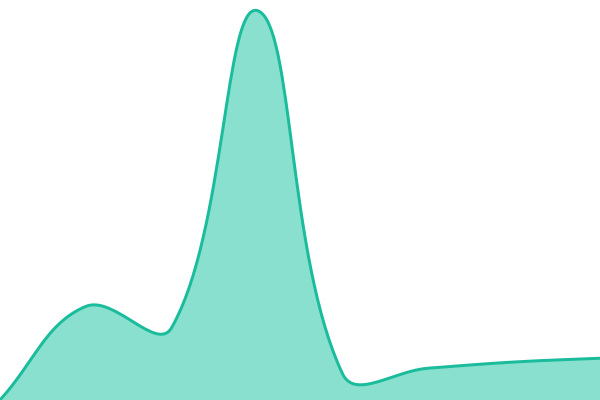
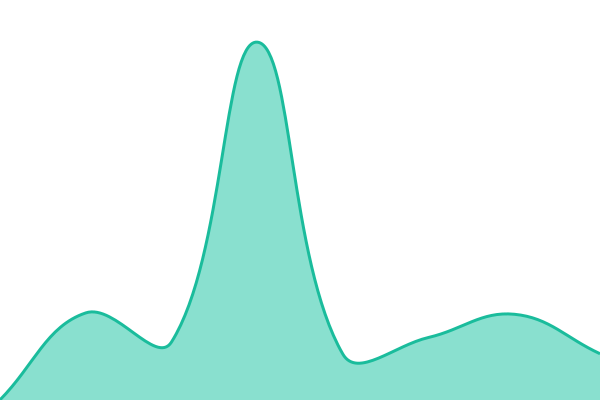

# [📈 Live Status](https://tdulcet.github.io/send-instances-status): <!--live status--> **🟧 Partial outage**

This repository contains the open-source uptime monitor and status page for [Teal Dulcet](https://www.tealdulcet.com/), powered by [Upptime](https://github.com/upptime/upptime).

With [Upptime](https://upptime.js.org), you can get your own unlimited and free uptime monitor and status page, powered entirely by a GitHub repository. We use [Issues](https://github.com/tdulcet/send-instances-status/issues) as incident reports, [Actions](https://github.com/tdulcet/send-instances-status/actions) as uptime monitors, and [Pages](https://tdulcet.github.io/send-instances-status) for the status page.

<!--start: status pages-->
<!-- This summary is generated by Upptime (https://github.com/upptime/upptime) -->
<!-- Do not edit this manually, your changes will be overwritten -->
<!-- prettier-ignore -->
| URL | Status | History | Response Time | Uptime |
| --- | ------ | ------- | ------------- | ------ |
|  [send.vis.ee](https://send.vis.ee) | 🟩 Up | [send-vis-ee.yml](https://github.com/tdulcet/send-instances-status/commits/HEAD/history/send-vis-ee.yml) | 

 932ms
     
 | 

<a href="https://tdulcet.github.io/send-instances-status/history/send-vis-ee">100.00%</a>
    

|  [send.mni.li](https://send.mni.li) | 🟩 Up | [send-mni-li.yml](https://github.com/tdulcet/send-instances-status/commits/HEAD/history/send-mni-li.yml) | 

 2423ms
     
 | 

<a href="https://tdulcet.github.io/send-instances-status/history/send-mni-li">100.00%</a>
    

|  [send.monks.tools](https://send.monks.tools) | 🟩 Up | [send-monks-tools.yml](https://github.com/tdulcet/send-instances-status/commits/HEAD/history/send-monks-tools.yml) | 

 604ms
     
 | 

<a href="https://tdulcet.github.io/send-instances-status/history/send-monks-tools">100.00%</a>
    

|  [send.aurorabilisim.com](https://send.aurorabilisim.com) | 🟥 Down | [send-aurorabilisim-com.yml](https://github.com/tdulcet/send-instances-status/commits/HEAD/history/send-aurorabilisim-com.yml) | 

 28ms
     
 | 

<a href="https://tdulcet.github.io/send-instances-status/history/send-aurorabilisim-com">0.00%</a>
    

|  [send.artemislena.eu](https://send.artemislena.eu) | 🟩 Up | [send-artemislena-eu.yml](https://github.com/tdulcet/send-instances-status/commits/HEAD/history/send-artemislena-eu.yml) | 

 614ms
     
 | 

<a href="https://tdulcet.github.io/send-instances-status/history/send-artemislena-eu">100.00%</a>
    

|  [fileupload.ggc-project.de](https://fileupload.ggc-project.de) | 🟩 Up | [fileupload-ggc-project-de.yml](https://github.com/tdulcet/send-instances-status/commits/HEAD/history/fileupload-ggc-project-de.yml) | 

 5130ms
     
 | 

<a href="https://tdulcet.github.io/send-instances-status/history/fileupload-ggc-project-de">99.27%</a>
    

|  [drop.chapril.org](https://drop.chapril.org) | 🟥 Down | [drop-chapril-org.yml](https://github.com/tdulcet/send-instances-status/commits/HEAD/history/drop-chapril-org.yml) | 

 3333ms
     
 | 

<a href="https://tdulcet.github.io/send-instances-status/history/drop-chapril-org">98.44%</a>
    

|  [send.jeugdhulp.be](https://send.jeugdhulp.be) | 🟩 Up | [send-jeugdhulp-be.yml](https://github.com/tdulcet/send-instances-status/commits/HEAD/history/send-jeugdhulp-be.yml) | 

 1259ms
     
 | 

<a href="https://tdulcet.github.io/send-instances-status/history/send-jeugdhulp-be">100.00%</a>
    

|  [send.cyberjake.xyz](https://send.cyberjake.xyz) | 🟩 Up | [send-cyberjake-xyz.yml](https://github.com/tdulcet/send-instances-status/commits/HEAD/history/send-cyberjake-xyz.yml) | 

 234ms
     
 | 

<a href="https://tdulcet.github.io/send-instances-status/history/send-cyberjake-xyz">100.00%</a>
    

|  [send.adminforge.de](https://send.adminforge.de) | 🟩 Up | [send-adminforge-de.yml](https://github.com/tdulcet/send-instances-status/commits/HEAD/history/send-adminforge-de.yml) | 

 679ms
     
 | 

<a href="https://tdulcet.github.io/send-instances-status/history/send-adminforge-de">100.00%</a>
    

|  [send.turingpoint.de](https://send.turingpoint.de) | 🟩 Up | [send-turingpoint-de.yml](https://github.com/tdulcet/send-instances-status/commits/HEAD/history/send-turingpoint-de.yml) | 

 630ms
     
 | 

<a href="https://tdulcet.github.io/send-instances-status/history/send-turingpoint-de">86.19%</a>
    

|  [send.aslaets.be](https://send.aslaets.be) | 🟩 Up | [send-aslaets-be.yml](https://github.com/tdulcet/send-instances-status/commits/HEAD/history/send-aslaets-be.yml) | 

 606ms
     
 | 

<a href="https://tdulcet.github.io/send-instances-status/history/send-aslaets-be">100.00%</a>
    

|  [send.codespace.cz](https://send.codespace.cz) | 🟩 Up | [send-codespace-cz.yml](https://github.com/tdulcet/send-instances-status/commits/HEAD/history/send-codespace-cz.yml) | 

 963ms
     
 | 

<a href="https://tdulcet.github.io/send-instances-status/history/send-codespace-cz">100.00%</a>
    

|  [upload.nolog.cz](https://upload.nolog.cz) | 🟩 Up | [upload-nolog-cz.yml](https://github.com/tdulcet/send-instances-status/commits/HEAD/history/upload-nolog-cz.yml) | 

 2612ms
     
 | 

<a href="https://tdulcet.github.io/send-instances-status/history/upload-nolog-cz">100.00%</a>
    

|  [ch.skysend.ch](https://ch.skysend.ch) | 🟩 Up | [ch-skysend-ch.yml](https://github.com/tdulcet/send-instances-status/commits/HEAD/history/ch-skysend-ch.yml) | 

 617ms
     
 | 

<a href="https://tdulcet.github.io/send-instances-status/history/ch-skysend-ch">100.00%</a>
    

|  [de.skysend.ch](https://de.skysend.ch) | 🟩 Up | [de-skysend-ch.yml](https://github.com/tdulcet/send-instances-status/commits/HEAD/history/de-skysend-ch.yml) | 

 249ms
     
 | 

<a href="https://tdulcet.github.io/send-instances-status/history/de-skysend-ch">100.00%</a>
    

|  [send.canine.tools](https://send.canine.tools) | 🟥 Down | [send-canine-tools.yml](https://github.com/tdulcet/send-instances-status/commits/HEAD/history/send-canine-tools.yml) | 

 0ms
     
 | 

<a href="https://tdulcet.github.io/send-instances-status/history/send-canine-tools">0.00%</a>
    

|  [send.skylerszijjarto.com](https://send.skylerszijjarto.com) | 🟥 Down | [send-skylerszijjarto-com.yml](https://github.com/tdulcet/send-instances-status/commits/HEAD/history/send-skylerszijjarto-com.yml) | 

 0ms
     
 | 

<a href="https://tdulcet.github.io/send-instances-status/history/send-skylerszijjarto-com">0.00%</a>
    

|  [send.blablalinux.be](https://send.blablalinux.be) | 🟩 Up | [send-blablalinux-be.yml](https://github.com/tdulcet/send-instances-status/commits/HEAD/history/send-blablalinux-be.yml) | 

 781ms
     
 | 

<a href="https://tdulcet.github.io/send-instances-status/history/send-blablalinux-be">100.00%</a>
    

|  [send.hostnetwork.xyz](https://send.hostnetwork.xyz) | 🟥 Down | [send-hostnetwork-xyz.yml](https://github.com/tdulcet/send-instances-status/commits/HEAD/history/send-hostnetwork-xyz.yml) | 

 794ms
     
 | 

<a href="https://tdulcet.github.io/send-instances-status/history/send-hostnetwork-xyz">85.61%</a>
    

|  [dropnito.online](https://dropnito.online) | 🟩 Up | [dropnito-online.yml](https://github.com/tdulcet/send-instances-status/commits/HEAD/history/dropnito-online.yml) | 

 898ms
     
 | 

<a href="https://tdulcet.github.io/send-instances-status/history/dropnito-online">100.00%</a>
    

<!--end: status pages-->

[**Visit our status website →**](https://tdulcet.github.io/send-instances-status)

## 📄 License

- Powered by: [Upptime](https://github.com/upptime/upptime)
- Code: [MIT](./LICENSE) © [Teal Dulcet](https://www.tealdulcet.com/)
- Data in the `./history` directory: [Open Database License](https://opendatacommons.org/licenses/odbl/1-0/)
