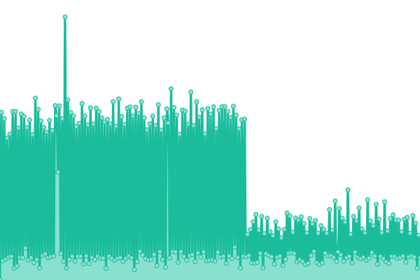

# [📈 Live Status](https://tdulcet.github.io/send-instances-status): <!--live status--> **🟧 Partial outage**

This repository contains the open-source uptime monitor and status page for [Teal Dulcet](https://www.tealdulcet.com/), powered by [Upptime](https://github.com/upptime/upptime).

With [Upptime](https://upptime.js.org), you can get your own unlimited and free uptime monitor and status page, powered entirely by a GitHub repository. We use [Issues](https://github.com/tdulcet/send-instances-status/issues) as incident reports, [Actions](https://github.com/tdulcet/send-instances-status/actions) as uptime monitors, and [Pages](https://tdulcet.github.io/send-instances-status) for the status page.

<!--start: status pages-->
<!-- This summary is generated by Upptime (https://github.com/upptime/upptime) -->
<!-- Do not edit this manually, your changes will be overwritten -->
<!-- prettier-ignore -->
| URL | Status | History | Response Time | Uptime |
| --- | ------ | ------- | ------------- | ------ |
|  [send.vis.ee](https://send.vis.ee) | 🟩 Up | [send-vis-ee.yml](https://github.com/tdulcet/send-instances-status/commits/HEAD/history/send-vis-ee.yml) | 

 941ms
     
 | 

<a href="https://tdulcet.github.io/send-instances-status/history/send-vis-ee">100.00%</a>
    

|  [send.zcyph.cc](https://send.zcyph.cc) | 🟩 Up | [send-zcyph-cc.yml](https://github.com/tdulcet/send-instances-status/commits/HEAD/history/send-zcyph-cc.yml) | 

 538ms
     
 | 

<a href="https://tdulcet.github.io/send-instances-status/history/send-zcyph-cc">100.00%</a>
    

|  [send.ephemeral.land](https://send.ephemeral.land) | 🟩 Up | [send-ephemeral-land.yml](https://github.com/tdulcet/send-instances-status/commits/HEAD/history/send-ephemeral-land.yml) | 

 2307ms
     
 | 

<a href="https://tdulcet.github.io/send-instances-status/history/send-ephemeral-land">100.00%</a>
    

|  [send.mni.li](https://send.mni.li) | 🟥 Down | [send-mni-li.yml](https://github.com/tdulcet/send-instances-status/commits/HEAD/history/send-mni-li.yml) | 

 487ms
     
 | 

<a href="https://tdulcet.github.io/send-instances-status/history/send-mni-li">0.00%</a>
    

|  [send.monks.tools](https://send.monks.tools) | 🟩 Up | [send-monks-tools.yml](https://github.com/tdulcet/send-instances-status/commits/HEAD/history/send-monks-tools.yml) | 

 466ms
     
 | 

<a href="https://tdulcet.github.io/send-instances-status/history/send-monks-tools">100.00%</a>
    

|  [send.boblorange.net](https://send.boblorange.net) | 🟩 Up | [send-boblorange-net.yml](https://github.com/tdulcet/send-instances-status/commits/HEAD/history/send-boblorange-net.yml) | 

 712ms
     
 | 

<a href="https://tdulcet.github.io/send-instances-status/history/send-boblorange-net">100.00%</a>
    

|  [send.aurorabilisim.com](https://send.aurorabilisim.com) | 🟥 Down | [send-aurorabilisim-com.yml](https://github.com/tdulcet/send-instances-status/commits/HEAD/history/send-aurorabilisim-com.yml) | 

 209ms
     
 | 

<a href="https://tdulcet.github.io/send-instances-status/history/send-aurorabilisim-com">34.30%</a>
    

|  [send.artemislena.eu](https://send.artemislena.eu) | 🟩 Up | [send-artemislena-eu.yml](https://github.com/tdulcet/send-instances-status/commits/HEAD/history/send-artemislena-eu.yml) | 

 982ms
     
 | 

<a href="https://tdulcet.github.io/send-instances-status/history/send-artemislena-eu">100.00%</a>
    

|  [send.datahoarder.dev](https://send.datahoarder.dev) | 🟩 Up | [send-datahoarder-dev.yml](https://github.com/tdulcet/send-instances-status/commits/HEAD/history/send-datahoarder-dev.yml) | 

 623ms
     
 | 

<a href="https://tdulcet.github.io/send-instances-status/history/send-datahoarder-dev">100.00%</a>
    

|  [fileupload.ggc-project.de](https://fileupload.ggc-project.de) | 🟩 Up | [fileupload-ggc-project-de.yml](https://github.com/tdulcet/send-instances-status/commits/HEAD/history/fileupload-ggc-project-de.yml) | 

 466ms
     
 | 

<a href="https://tdulcet.github.io/send-instances-status/history/fileupload-ggc-project-de">99.82%</a>
    

|  [drop.chapril.org](https://drop.chapril.org) | 🟩 Up | [drop-chapril-org.yml](https://github.com/tdulcet/send-instances-status/commits/HEAD/history/drop-chapril-org.yml) | 

 665ms
     
 | 

<a href="https://tdulcet.github.io/send-instances-status/history/drop-chapril-org">91.87%</a>
    

|  [send.jeugdhulp.be](https://send.jeugdhulp.be) | 🟩 Up | [send-jeugdhulp-be.yml](https://github.com/tdulcet/send-instances-status/commits/HEAD/history/send-jeugdhulp-be.yml) | 

 1104ms
     
 | 

<a href="https://tdulcet.github.io/send-instances-status/history/send-jeugdhulp-be">100.00%</a>
    

|  [files.psu.ru](https://files.psu.ru) | 🟩 Up | [files-psu-ru.yml](https://github.com/tdulcet/send-instances-status/commits/HEAD/history/files-psu-ru.yml) | 

 1112ms
     
 | 

<a href="https://tdulcet.github.io/send-instances-status/history/files-psu-ru">100.00%</a>
    

|  [send.portailpro.net](https://send.portailpro.net) | 🟩 Up | [send-portailpro-net.yml](https://github.com/tdulcet/send-instances-status/commits/HEAD/history/send-portailpro-net.yml) | 

 611ms
     
 | 

<a href="https://tdulcet.github.io/send-instances-status/history/send-portailpro-net">100.00%</a>
    

|  [transfer.acted.org](https://transfer.acted.org) | 🟩 Up | [transfer-acted-org.yml](https://github.com/tdulcet/send-instances-status/commits/HEAD/history/transfer-acted-org.yml) | 

 549ms
     
 | 

<a href="https://tdulcet.github.io/send-instances-status/history/transfer-acted-org">100.00%</a>
    

|  [send.datenpost.app](https://send.datenpost.app) | 🟩 Up | [send-datenpost-app.yml](https://github.com/tdulcet/send-instances-status/commits/HEAD/history/send-datenpost-app.yml) | 

 885ms
     
 | 

<a href="https://tdulcet.github.io/send-instances-status/history/send-datenpost-app">100.00%</a>
    

|  [send.angelic.icu](https://send.angelic.icu) | 🟥 Down | [send-angelic-icu.yml](https://github.com/tdulcet/send-instances-status/commits/HEAD/history/send-angelic-icu.yml) | 

 0ms
     
 | 

<a href="https://tdulcet.github.io/send-instances-status/history/send-angelic-icu">0.00%</a>
    

|  [s.opnxng.com](https://s.opnxng.com) | 🟩 Up | [s-opnxng-com.yml](https://github.com/tdulcet/send-instances-status/commits/HEAD/history/s-opnxng-com.yml) | 

 776ms
     
 | 

<a href="https://tdulcet.github.io/send-instances-status/history/s-opnxng-com">99.85%</a>
    

|  [send.whateveritworks.org](https://send.whateveritworks.org) | 🟩 Up | [send-whateveritworks-org.yml](https://github.com/tdulcet/send-instances-status/commits/HEAD/history/send-whateveritworks-org.yml) | 

 551ms
     
 | 

<a href="https://tdulcet.github.io/send-instances-status/history/send-whateveritworks-org">100.00%</a>
    

|  [send.cyberjake.xyz](https://send.cyberjake.xyz) | 🟩 Up | [send-cyberjake-xyz.yml](https://github.com/tdulcet/send-instances-status/commits/HEAD/history/send-cyberjake-xyz.yml) | 

 175ms
     
 | 

<a href="https://tdulcet.github.io/send-instances-status/history/send-cyberjake-xyz">100.00%</a>
    

|  [send.kokomo.cloud](https://send.kokomo.cloud) | 🟩 Up | [send-kokomo-cloud.yml](https://github.com/tdulcet/send-instances-status/commits/HEAD/history/send-kokomo-cloud.yml) | 

 164ms
     
 | 

<a href="https://tdulcet.github.io/send-instances-status/history/send-kokomo-cloud">99.80%</a>
    

|  [send.adminforge.de](https://send.adminforge.de) | 🟩 Up | [send-adminforge-de.yml](https://github.com/tdulcet/send-instances-status/commits/HEAD/history/send-adminforge-de.yml) | 

 865ms
     
 | 

<a href="https://tdulcet.github.io/send-instances-status/history/send-adminforge-de">100.00%</a>
    

|  [send.turingpoint.de](https://send.turingpoint.de) | 🟩 Up | [send-turingpoint-de.yml](https://github.com/tdulcet/send-instances-status/commits/HEAD/history/send-turingpoint-de.yml) | 

 507ms
     
 | 

<a href="https://tdulcet.github.io/send-instances-status/history/send-turingpoint-de">100.00%</a>
    

<!--end: status pages-->

[**Visit our status website →**](https://tdulcet.github.io/send-instances-status)

## 📄 License

- Powered by: [Upptime](https://github.com/upptime/upptime)
- Code: [MIT](./LICENSE) © [Teal Dulcet](https://www.tealdulcet.com/)
- Data in the `./history` directory: [Open Database License](https://opendatacommons.org/licenses/odbl/1-0/)
